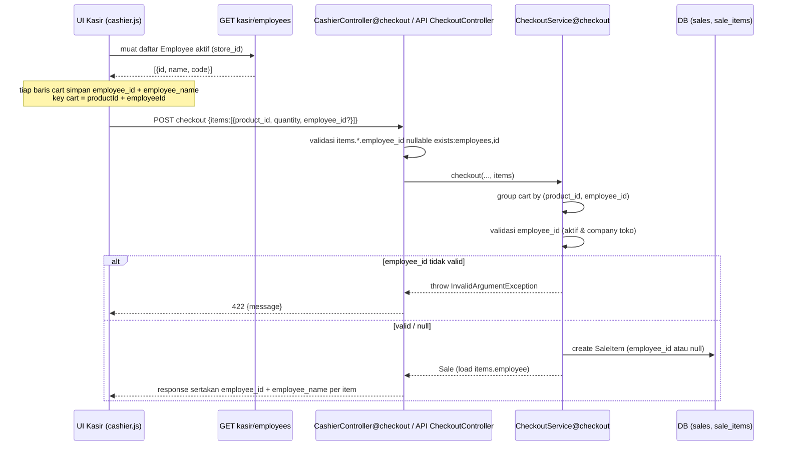
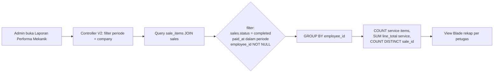

# Design Document

## Overview

Fitur **POS Mechanic Tracking** menambahkan pencatatan petugas pengerjaan (mekanik/salesman) ke transaksi Point of Sale, pada granularitas **per item** (`SaleItem`), bukan per nota. Tujuannya: memantau performa tiap petugas melalui laporan rekap per periode, sebagai dasar bonus/reward di masa depan.

Keputusan desain final yang menjadi dasar (D1–D6):

- **D1** — Penautan petugas **per item** lewat kolom `employee_id` di tabel `sale_items`.
- **D2** — Satu konsep "Petugas" = `Employee` (tanpa pembedaan peran mekanik vs salesman).
- **D3** — Penautan **opsional** untuk semua item (`service` maupun `goods`).
- **D4** — Sumber petugas = `Employee` dengan `is_active = true` dan `company_id` sama dengan company toko transaksi.
- **D5** — Laporan **rekap saja**: jumlah item jasa, total nilai jasa (`line_total`), jumlah transaksi. **Tanpa** komisi/persentase.
- **D6** — Rekap hanya transaksi POS berstatus **terbayar/selesai** (`Sale.status = 'completed'`).

Fitur memanfaatkan infrastruktur yang sudah ada: `CheckoutService` (dipakai kasir web dan API v1), master `Employee`, dan stack laporan V2 (Blade + Tailwind). Tidak ada skema baru selain satu kolom nullable, sehingga backward compatibility terjaga (Requirement 6).

### Lingkup

Termasuk:
- Migrasi kolom `employee_id` nullable di `sale_items`.
- Penyimpanan `employee_id` per item saat checkout web & API, dengan validasi.
- Pemilih Petugas per baris cart di UI kasir + endpoint daftar karyawan aktif.
- Penyertaan `employee_id`/`employee_name` di resource & payload response.
- Halaman laporan rekap performa petugas (V2, admin/superuser).

Tidak termasuk: perhitungan komisi, peran khusus mekanik, penautan per-nota, perubahan skema lain.

## Architecture

Sistem mengikuti arsitektur Laravel yang ada: Controller (web `CashierController`, API `Api\V1\CheckoutController`, laporan `V2\ReportController`/controller baru) → `CheckoutService` (domain logic + transaksi DB) → Eloquent Models. UI kasir adalah Blade + JS vanilla (`public/cashier/cashier.js`) yang memanggil endpoint JSON.

### Alur Data Checkout (dengan petugas)



### Alur Data Laporan Performa



Catatan periode: ikut pola `ReportController` yang ada — single company via `Company::query()->first()`, rentang `from`/`to` default `startOfMonth()`..`now()`. Filter waktu memakai `sales.paid_at` (atau `created_at` bila perlu) dalam rentang inklusif.

## Components and Interfaces

Daftar file yang **ditambah** dan **diubah**, beserta signature relevan. Tidak ada kode aplikasi yang ditulis pada tahap desain ini; bagian ini adalah kontrak untuk fase tasks.

### 1. Migrasi (tambah)

`database/migrations/xxxx_xx_xx_add_employee_id_to_sale_items_table.php`

```php
// Penautan petugas per item (mekanik/salesman). Nullable agar transaksi
// lama & item tanpa petugas tetap valid (backward compatibility, D3/Req 6).
Schema::table('sale_items', function (Blueprint $table) {
    $table->foreignId('employee_id')->nullable()->after('product_type')
        ->constrained('employees')->nullOnDelete();
});
```

- Hanya menambah satu kolom. Tidak mengubah skema lain.
- `nullOnDelete`: bila Employee dihapus, item tetap ada dengan `employee_id = null` (riwayat tidak rusak).

### 2. Model `App\Models\SaleItem` (ubah)

- Tambah `'employee_id'` ke atribut `#[Fillable([...])]`.
- Tambah relasi:

```php
public function employee(): BelongsTo
{
    return $this->belongsTo(Employee::class);
}
```

### 3. Model `App\Models\Employee` (ubah, opsional)

```php
public function handledSaleItems(): HasMany
{
    return $this->hasMany(SaleItem::class);
}
```

### 4. `App\Services\CheckoutService::checkout()` (ubah)

Signature tidak berubah; perubahan ada pada pemrosesan `$items`. Tiap baris `$items` boleh menyertakan `employee_id`:

```php
/**
 * @param array<int, array{product_id:int, quantity:int, employee_id?:int|null,
 *   service_fee_amount?:float|null, tax_amount?:float|null}> $items
 */
```

Perubahan internal:

1. **Grouping cart** — saat ini cart di-`groupBy('product_id')`. Karena penautan per item dan satu produk bisa dikerjakan mekanik berbeda, grouping diubah menjadi **kombinasi `product_id + employee_id`**:

   ```php
   $cart = collect($items)
       ->groupBy(fn ($row) => $row['product_id'].'-'.($row['employee_id'] ?? 'null'))
       ->map(function ($rows) {
           $row = $rows->last();
           return [
               'product_id' => (int) $row['product_id'],
               'employee_id' => $row['employee_id'] ?? null,
               'quantity' => (int) $rows->sum('quantity'),
               'service_fee_amount' => /* seperti sebelumnya */,
               'tax_amount' => /* seperti sebelumnya */,
           ];
       })
       ->filter(fn (array $item) => $item['quantity'] > 0);
   ```

   **Dampak pada qty/subtotal**: baris dengan produk sama tetapi petugas berbeda **tidak digabung** → menghasilkan beberapa `SaleItem` terpisah untuk produk yang sama. Qty hanya dijumlahkan antar baris dengan kombinasi `(product_id, employee_id)` identik. Subtotal/total transaksi **tidak berubah** karena harga per unit sama; yang berubah hanya jumlah baris item (granularitas). Validasi stok dihitung atas total qty produk lintas grup (lihat poin 3) agar pengecekan stok tetap benar.

2. **Resolusi produk** — kunci cart kini bukan `product_id`. Kumpulkan `product_id` unik dari grup untuk query `Product::whereIn('id', $productIds)`. Validasi "produk ditemukan" dibandingkan terhadap jumlah `product_id` unik, bukan jumlah grup.

3. **Validasi stok** — jumlahkan qty per `product_id` lintas semua grup sebelum membandingkan dengan stok, agar produk sama yang terbagi ke beberapa mekanik tidak lolos validasi stok secara keliru.

4. **Validasi petugas** — bila `employee_id` terisi pada sebuah grup, validasi:

   ```php
   // store->company_id menentukan company transaksi
   $validEmployeeIds = Employee::query()
       ->where('company_id', $store->company_id)
       ->where('is_active', true)
       ->pluck('id');
   // untuk tiap employee_id non-null:
   if (! $validEmployeeIds->contains($employeeId)) {
       throw new InvalidArgumentException('Petugas tidak valid untuk toko ini.');
   }
   ```

   Pola error konsisten dengan validasi lain di service (lempar `InvalidArgumentException`, ditangkap controller → 422). `employee_id` null dilewati tanpa error (opsional).

5. **Pembuatan SaleItem** — sertakan `'employee_id' => $cartItem['employee_id']` pada `$sale->items()->create([...])`.

6. **Eager load** — kembalikan `$sale->load(['items.employee', 'cashier', 'store', 'payments'])` agar nama petugas tersedia untuk response.

### 5. `App\Http\Controllers\CashierController` (ubah + tambah)

- **`checkout()`**: tambah aturan validasi
  `'items.*.employee_id' => ['nullable', 'integer', 'exists:employees,id']`.
  Teruskan `employee_id` apa adanya (sudah ada di `$data['items']`).
- **Response `checkout()`**: pada map `items`, tambah `'employee_id'` dan `'employee_name' => $item->employee?->name`.
- **`salePayload()`**: pada map `items`, tambah `employee_id` + `employee_name`.
- **Tambah `employees()`** — endpoint daftar karyawan aktif untuk picker:

  ```php
  public function employees(Request $request): JsonResponse
  // query: store_id (wajib, dicek canAccessStore), q (opsional)
  // sumber: Employee where company_id = store->company_id, is_active = true
  // filter q: name LIKE / code LIKE
  // return: [{id, name, code}], limit wajar (mis. 50)
  ```

### 6. Route `routes/web.php` grup `kasir` (tambah)

```php
Route::get('/employees', [CashierController::class, 'employees'])
    ->middleware('auth')->name('employees');
```

### 7. `App\Http\Requests\Api\V1\CheckoutRequest` (ubah)

Tambah aturan:

```php
'items.*.employee_id' => ['nullable', 'integer', 'exists:employees,id'],
```

API mengirim `employee_id` per item; `CheckoutController@store` sudah meneruskan `$data['items']` ke service tanpa perubahan.

### 8. `App\Http\Resources\SaleItemResource` (ubah)

Tambah ke array:

```php
'employee_id' => $this->employee_id,
'employee_name' => $this->whenLoaded('employee', fn () => $this->employee?->name),
```

Agar `employee_name` terisi, relasi di-load via `items.employee` (lihat poin 4.6 dan `SaleResource`/controller API yang memanggil `load(['items', ...])` → ubah menjadi `items.employee`).

### 9. UI Kasir (ubah)

`resources/views/cashier/*` + `public/cashier/cashier.js`:

- Tiap baris cart menampilkan **pemilih Petugas** (dropdown/search) yang sumber datanya `GET kasir/employees?store_id=...&q=...`.
- **State cart**: tiap item menyimpan `employee_id` dan `employee_name`. Key cart = `productId + '-' + (employeeId ?? '')`.
- **Produk sama, mekanik berbeda** → menjadi **baris cart terpisah** (karena key berbeda). Menambah produk sama dengan petugas sama menambah qty pada baris yang ada.
- Saat checkout, kirim `employee_id` per item dalam payload `items`.
- Bila daftar petugas kosong (tidak ada Employee aktif), picker tampil kosong dan checkout tetap berjalan (Req 1.4).

### 10. Laporan Performa Mekanik (tambah)

- **Controller**: method baru di `App\Http\Controllers\V2\ReportController` (mis. `mechanicPerformance()`), mengikuti pola `period($request)`.

  ```php
  public function mechanicPerformance(Request $request): View
  // akses: hanya admin/superuser → abort_unless(in_array(role, ['admin','superuser']))
  // [$company, $from, $to] = $this->period($request)
  // query agregasi (lihat Data Models / Testing)
  // return view('v2.reports.mechanic-performance', [...])
  ```

- **Route** (`routes/web.php`, grup `v2`, area laporan):

  ```php
  Route::get('laporan/performa-mekanik',
      [\App\Http\Controllers\V2\ReportController::class, 'mechanicPerformance'])
      ->name('reports.mechanic-performance');
  ```

- **Nav** (`resources/views/v2/layouts/nav.blade.php`, grup `Laporan`): tambah
  `['v2.reports.mechanic-performance', 'Performa Mekanik']`.

- **View**: `resources/views/v2/reports/mechanic-performance.blade.php` — form rentang tanggal + tabel rekap. Bila kosong tampilkan keterangan "tidak ada data" (Req 5.7).

- **Query agregasi** (group by `employee_id`):

  ```php
  SaleItem::query()
      ->join('sales', 'sales.id', '=', 'sale_items.sale_id')
      ->join('stores', 'stores.id', '=', 'sales.store_id')
      ->whereNotNull('sale_items.employee_id')
      ->where('stores.company_id', $company->id)
      ->where('sales.status', 'completed')
      ->whereBetween('sales.paid_at', [$from, $to])
      ->where('sale_items.product_type', 'service') // jumlah & nilai jasa
      ->groupBy('sale_items.employee_id')
      ->selectRaw('sale_items.employee_id,
          COUNT(*) as service_count,
          SUM(sale_items.line_total) as service_total,
          COUNT(DISTINCT sale_items.sale_id) as sale_count')
      ->get();
  ```

  Nama petugas diambil via join/`with` ke `employees`. Item `employee_id IS NULL` otomatis tereksklusi (Req 6.2).

### Akses (Requirement 7)

- Kasir: endpoint `kasir/*` di bawah `middleware('auth')` (peran kasir mengakses kasir).
- Laporan performa: `abort_unless(in_array(Auth::user()->role, ['admin','superuser'], true), 403)` — konsisten dengan `StoreController@authorizeManage`/`PosController@void`.

## Data Models

### Tabel `sale_items` — kolom baru

| Kolom | Tipe | Null | Default | Keterangan |
|---|---|---|---|---|
| `employee_id` | `unsignedBigInteger` (FK → `employees.id`) | Ya | `null` | Petugas yang mengerjakan/menjual item. `nullOnDelete`. Opsional (D3). |

- Tidak ada perubahan kolom lain.
- Item lama: `employee_id = null` (Req 6.1).

### Relasi

- `SaleItem belongsTo Employee` (`employee()`), nullable.
- `Employee hasMany SaleItem` (`handledSaleItems()`), opsional.
- Rantai company untuk validasi & laporan: `SaleItem → Sale → Store → company_id`; `Employee.company_id` harus sama.

### Bentuk data laporan (per baris rekap)

| Field | Sumber | Keterangan |
|---|---|---|
| `employee_id` / `employee_name` | `employees` | identitas petugas |
| `service_count` | `COUNT(*)` item `service` tertaut | Req 5.2 |
| `service_total` | `SUM(line_total)` item `service` tertaut | Req 5.3 |
| `sale_count` | `COUNT(DISTINCT sale_id)` | Req 5.4 |

Semua difilter `sales.status = 'completed'` dan periode (Req 5.5, D6).

## Correctness Properties

*A property is a characteristic or behavior that should hold true across all valid executions of a system — essentially, a formal statement about what the system should do. Properties serve as the bridge between human-readable specifications and machine-verifiable correctness guarantees.*

Sebagian besar fitur ini adalah CRUD/UI/laporan, tetapi terdapat beberapa logika dengan properti universal yang bermakna: transformasi grouping cart, pemetaan persistensi per item, penolakan input tidak valid, dan invariant agregasi laporan. Properti berikut diuji secara property-based; sisanya (UI, akses, render contoh) memakai unit/integration test (lihat Testing Strategy).

### Property 1: Grouping cart per (product_id, employee_id)

*For any* daftar item checkout dengan `product_id` dan `employee_id` acak (termasuk null), `CheckoutService` membuat tepat satu `SaleItem` untuk setiap kombinasi unik `(product_id, employee_id)`, dengan `quantity` sama dengan jumlah qty seluruh baris berkombinasi sama; produk sama dengan `employee_id` berbeda menghasilkan baris terpisah, dan total nilai transaksi (grand total) tidak berubah oleh pemecahan baris ini.

**Validates: Requirements 2.2, 2.4**

### Property 2: Persistensi & pemetaan petugas per item

*For any* checkout (jalur web maupun API) dengan campuran item bertaut petugas valid dan item tanpa petugas, setiap `SaleItem` yang tersimpan memiliki `employee_id` yang sama persis dengan yang dikirim untuk kombinasinya (id valid tersimpan apa adanya, item tanpa petugas tersimpan `null`).

**Validates: Requirements 2.1, 3.1, 3.2, 4.1, 4.2**

### Property 3: Penolakan petugas tidak valid

*For any* `employee_id` yang tidak merujuk Employee aktif dalam company toko transaksi (nonaktif, company berbeda, atau tidak ada), checkout (web dan API) ditolak dengan kesalahan validasi yang menyebut petugas tidak valid, dan tidak ada `Sale`/`SaleItem` yang tersimpan.

**Validates: Requirements 3.3, 4.3**

### Property 4: Agregasi laporan performa benar

*For any* himpunan `SaleItem` dan `Sale` acak (status, periode, `employee_id` null/non-null, `product_type` bervariasi), rekap performa per petugas sama dengan oracle referensi yang hanya menghitung item `service` bertaut petugas dari `Sale` berstatus `completed` dalam periode: `service_count` = jumlah item, `service_total` = jumlah `line_total`, `sale_count` = jumlah `sale_id` unik; item dengan `employee_id` null dan sale di luar periode/non-completed selalu dikecualikan; bila tidak ada item memenuhi syarat, rekap kosong.

**Validates: Requirements 5.1, 5.2, 5.3, 5.4, 5.5, 5.6, 6.2, 5.7**

### Property 5: Representasi item menyertakan petugas

*For any* `SaleItem` bertaut petugas, `SaleItemResource` (dan payload item pada response checkout) menyertakan `employee_id` dan `employee_name` petugas tertaut; untuk item tanpa petugas, kedua field bernilai null tanpa menimbulkan kesalahan.

**Validates: Requirements 4.4, 6.3**

## Error Handling

- **Petugas tidak valid saat checkout**: `CheckoutService` melempar `InvalidArgumentException('Petugas tidak valid untuk toko ini.')`. Controller web (`CashierController@checkout`) dan API (`CheckoutController@store`) menangkapnya → respons `422` dengan `{ "message": ... }`. Konsisten dengan pola error service yang ada (stok, diskon, pembayaran). Seluruh proses dalam `DB::transaction`, sehingga penolakan = rollback penuh (tidak ada Sale/SaleItem parsial).
- **Validasi request layer**: `items.*.employee_id => nullable|integer|exists:employees,id` menolak id yang tidak ada di tabel `employees` sebelum mencapai service (422 validasi standar Laravel). Service tetap melakukan validasi domain (aktif + company sama) karena `exists` saja tidak menjamin keduanya.
- **Employee dihapus setelah transaksi**: FK `nullOnDelete` → `employee_id` jadi null; laporan otomatis mengabaikannya, riwayat tidak rusak (Req 6).
- **Tidak ada employee aktif**: endpoint `employees` mengembalikan array kosong; UI menampilkan picker kosong; checkout tanpa petugas tetap berhasil (Req 1.4, 3.1).
- **Akses laporan tanpa peran admin**: `abort(403)` (Req 7.3).
- **Sale/item lama tanpa petugas**: render null aman di resource, payload, dan view (Req 6.1, 6.3).

## Testing Strategy

Pendekatan ganda: **property-based test** untuk properti universal di atas, **unit/feature test** untuk contoh, edge case, dan akses. Semua test PHPUnit dengan `RefreshDatabase` di SQLite (sesuai konvensi repo).

### Property-Based Testing

PBT diterapkan pada logika dengan input bervariasi bermakna. Library: gunakan generator data via **model factories** + perulangan acak (≥100 iterasi per properti) di dalam test PHPUnit; bila tersedia, manfaatkan paket PBT PHP yang sudah ada di proyek — **jangan implementasi PBT dari nol**. Tiap test ditandai komentar referensi properti.

Format tag: `// Feature: pos-mechanic-tracking, Property {n}: {teks properti}`

- **Property 1 (grouping cart)**: generate daftar item acak (product_id dari pool, employee_id null/valid acak, qty acak). Verifikasi jumlah SaleItem = jumlah kombinasi unik, qty teragregasi benar, grand total tidak berubah dibanding checkout tanpa pemecahan.
- **Property 2 (persistensi per item)**: generate cart campuran, checkout via service dan via endpoint, baca DB, cocokkan mapping `(product_id, employee_id)` → item.
- **Property 3 (penolakan invalid)**: generate employee_id invalid (nonaktif, company lain, id acak tak-ada di domain valid). Pastikan exception/422 dan tidak ada Sale tersimpan.
- **Property 4 (agregasi laporan)**: seed Sale & SaleItem acak (status, paid_at, employee_id, product_type). Bandingkan output query controller dengan oracle PHP murni. Periode acak.
- **Property 5 (resource)**: generate SaleItem (tertaut & tidak), render resource, assert field employee.

Setiap property test minimum **100 iterasi**.

### Unit / Feature Tests (contoh & edge case)

- Checkout web menyimpan `employee_id` per item (contoh konkret).
- Checkout service menyimpan `employee_id` per item.
- Employee tidak valid → checkout ditolak (web & API).
- Produk sama dengan mekanik berbeda → menghasilkan 2 baris `SaleItem` (contoh eksplisit grouping).
- API checkout menyertakan `employee_id` & response memuatnya.
- Transaksi tanpa petugas tetap berhasil (semua item null).
- Endpoint `employees`: hanya Employee aktif & company sama; filter `q`; kosong saat tak ada employee aktif (Req 1.4).
- Laporan performa: agregasi benar untuk dataset contoh; abaikan item lama (`employee_id` null) (Req 6.2); periode mengubah hasil (Req 5.6); kosong tanpa data (Req 5.7).
- Backward compatibility: SaleItem lama (`employee_id` null) tampil tanpa error dan tidak muncul di rekap.
- Akses: kasir dapat checkout & memuat employees (Req 7.1); admin/superuser dapat membuka laporan (Req 7.2); non-admin mendapat 403 (Req 7.3).

### Catatan PBT

Migrasi, route, nav, dan rendering view murni **tidak** diuji dengan PBT (gunakan feature/smoke test). Multiplisitas "maksimal satu petugas per item" (Req 2.6) dijamin oleh skema kolom tunggal — cukup smoke test, bukan properti.

## Traceability

| Requirement | Acceptance Criteria | Ditangani oleh |
|---|---|---|
| **1** Pemilihan petugas | 1.1–1.4 | Endpoint `CashierController@employees` + route `kasir/employees`; UI picker; Property-test daftar aktif/company; edge case daftar kosong |
| **2** Penautan per item | 2.1–2.6 | Kolom `sale_items.employee_id`; grouping `(product_id, employee_id)` di `CheckoutService`; Property 1 & 2; skema kolom tunggal (2.6) |
| **3** Opsional | 3.1–3.3 | `employee_id` nullable; Property 2 (null/mixed) & Property 3 (penolakan invalid); Error Handling |
| **4** API checkout | 4.1–4.4 | `CheckoutRequest` + `Api\V1\CheckoutController`; `SaleItemResource`/`SaleResource` load `items.employee`; Property 2, 3, 5 |
| **5** Laporan performa | 5.1–5.7 | `ReportController@mechanicPerformance` + route + nav + view; Property 4; feature test periode & kosong |
| **6** Kompatibilitas data lama | 6.1–6.3 | Kolom nullable + `nullOnDelete`; query laporan `WHERE employee_id NOT NULL`; render null aman; Property 4 & 5 |
| **7** Hak akses | 7.1–7.3 | `middleware('auth')` kasir; `abort_unless(role in [admin,superuser])` laporan; feature test akses |
